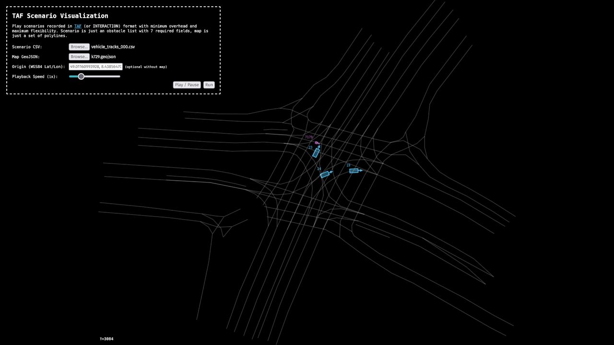

# 🚙 tafviz

Extremely simple and lean 2D visualization of traffic scenarios in 250 lines of JavaScript. Reads a CSV object list and an optional map (simple polylines stored as GeoJSON) and plays the scenario right in your browser without any dependencies. Written [by hand](https://muetsch.io/statement-about-generative-ai.html). Work in progress.



## Usage
```bash
python -m http.server
```

Go to http://localhost:8000.

## Input Data
### Object list
By default, the scenario format of [TAF-BW](https://github.com/fzi-forschungszentrum-informatik/test-area-autonomous-driving-dataset/) is used, which is mostly the same as used by the [INTERACTION](https://interaction-dataset.com/) dataset. However, by customizing the column names (see [`config.js`](src/config.js)), any CSV format that includes all of the 8 required fields can be read.

**Note:** A scenario origin point in lat / lon world coordinates is required when wanting to visualize on the map.

### Map
The optional map is read as a simple set of polylines for maximum flexibility. No Lanelet2 or OpenDrive format required. This allows to use self-drawn or auto-generated maps, which are not necessarily 100 % consistent.

#### Lanelet2 / OSM to GeoJSON
You can use GDAL to convert a Lanelet2 map from OSM format to GeoJSON.

```bash
OSM_USE_CUSTOM_INDEXING=NO ogr2ogr -f GeoJSON k729.geojson k729.osm lines
```

## Details
For proper visualization, metric coordinates (no lat / lon) are used internally. Thus, input lat / lon coordinates (by default, WGS84 is assumed) are automatically converted to web mercator projection.

## Example Data
* **Scenario:** [`vehicle_tracks_000.csv`](https://github.com/fzi-forschungszentrum-informatik/test-area-autonomous-driving-dataset/blob/master/datasets/recorded_trackfiles/k729_2022-03-16/vehicle_tracks_000.csv)
* **Map:** [`k729_2022-03-16.osm`](https://github.com/fzi-forschungszentrum-informatik/test-area-autonomous-driving-dataset/blob/master/datasets/maps/k729_2022-03-16.osm) (must be converted to GeoJSON)

## To Do
* [ ] Code cleanup
* [ ] Error handling
* [ ] Better user experience
* [ ] Zoom + Drag & Drop
* [ ] OSM / Lanelet2 support

## See it in action
[screencast.webm](https://github.com/user-attachments/assets/cf6de57b-01fc-49cb-aa3b-cc9ed425d94c)

## Disclaimer
This project is not affiliated with FZI Forschungszentrum Informatik Karlsruhe.

## License 
GPL-3.0
